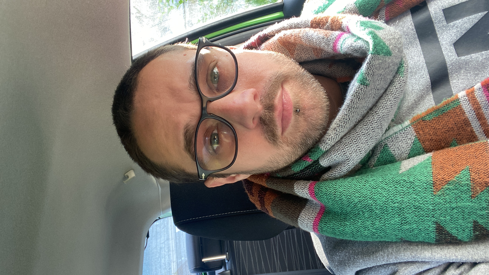

# markdown-challenge
# Cédric Wietkin
*Ce qui ne te tue pas, te rend plus fort!*

| My BirthDAy | Favorite color  | Favorite food    |
|-------------|-----------------|------------------|
|29/09/1988   | Blue Navy       |Sushi- Asian Food |
|Pinneapple on pizza | <ul><li> [] Yes</li><li> [x] NO!NO!</li></ul> |

## Hobbies
<ul>
<li>Basket-ball</li>
<li>Bricolage</li>
<li>Randonnée<ul><li>Vtt</li><li>Pédestre</li><li>Bivouac</li></li>

### Le Socialisateur
Le terme « socialisateur » désigne un agent, une action ou un contexte qui favorise le développement des compétences sociales et relationnelles d'un individu. Cela peut être une personne, un groupe, un lieu ou une activité permettant l'interaction et la communication entre les membres d'une société.
Les socialisateurs contribuent à l'épanouissement personnel et collectif en aidant chacun à s'adapter aux normes et valeurs du groupe, ainsi qu'à se sentir intégré et accepté parmi ses pairs. Ils jouent un rôle clé dans le processus de socialisation tout au long de la vie.